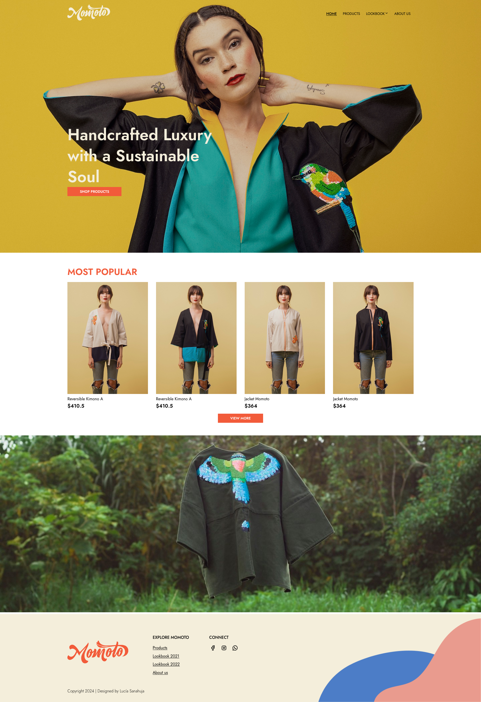
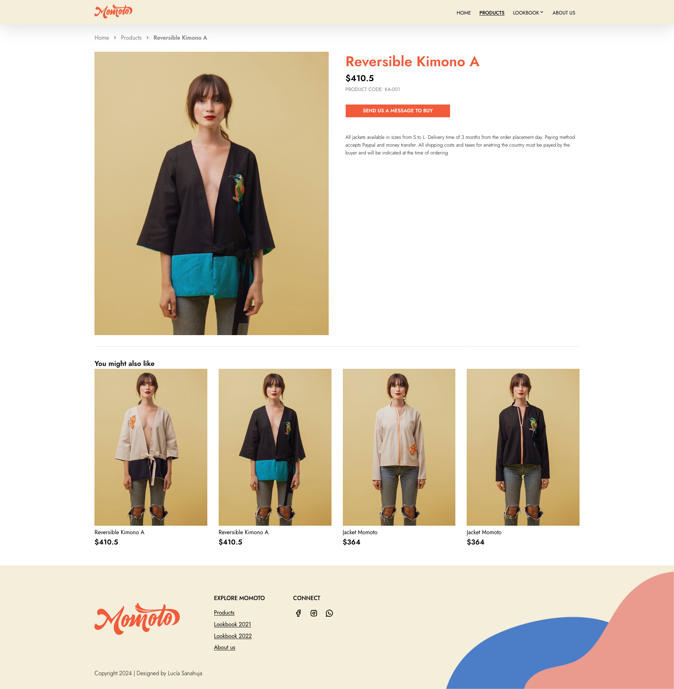

# Momoto Clothing Website

A frontend project for a modern clothing website.

## Getting Started

To get a local copy up and running, follow these simple steps.

### Prerequisites

You'll need to have [Node.js](https://nodejs.org/en/) and [npm](https://www.npmjs.com/) installed on your machine.

### Installation

1. **Clone the repo:**

    ```sh
    git clone https://github.com/lucys18/momoto-web.git
    cd momoto
    ```

2. **Install NPM packages:**

    ```sh
    npm install
    ```

### Running the App

Run the following command to start the development server:

```sh
npm start
```

## App screenshots





---

Created by Lucía Sanahuja
